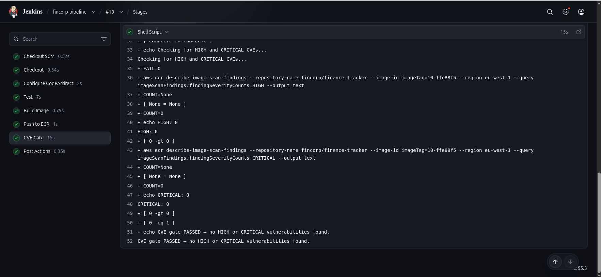
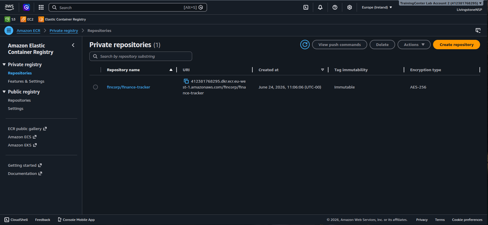
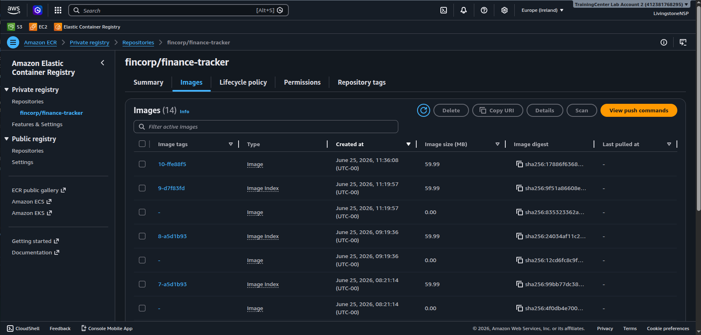
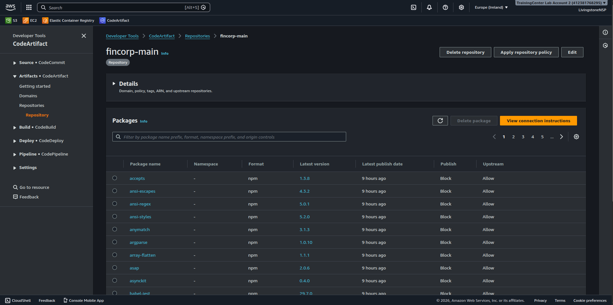
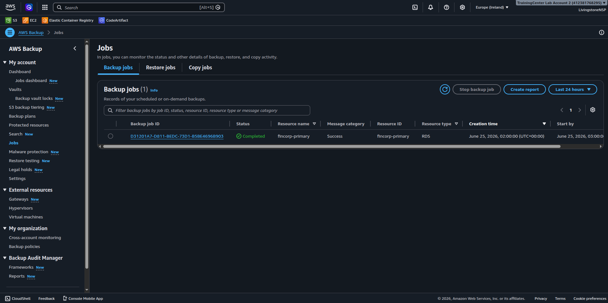
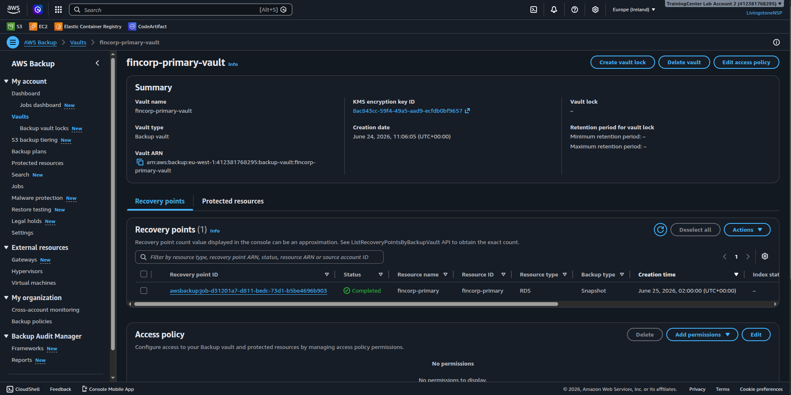
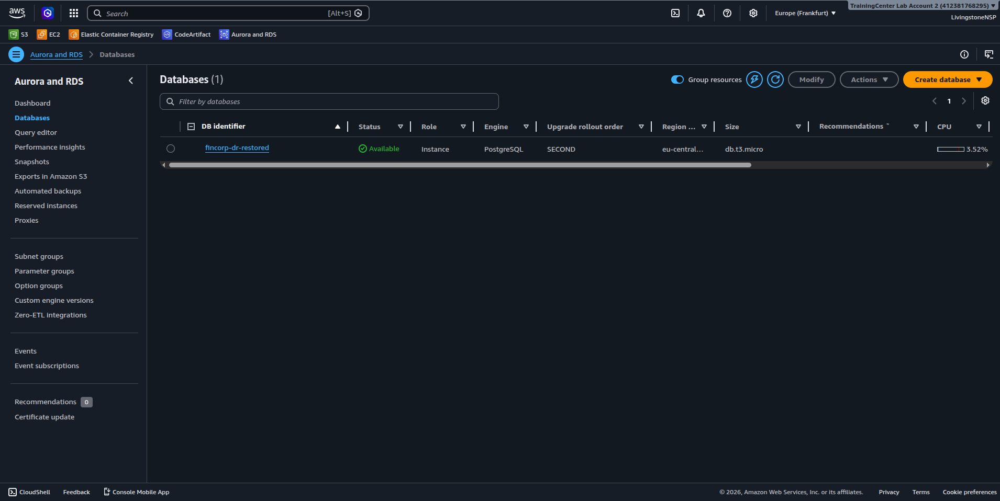
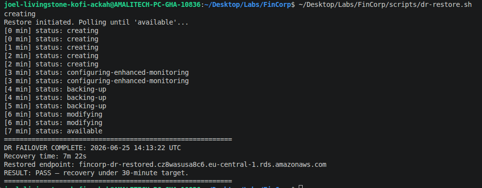

# FinCorp — The "Immutable and Indestructible" Pipeline

A secure software supply chain plus a cross-region disaster-recovery plan for FinCorp,
built end-to-end on AWS with Terraform and Jenkins.

**Scenario:** FinCorp requires a highly secure, auditable software supply chain and a
disaster-recovery plan that can restore its critical database in a different region
within **30 minutes**.

> **Region note:** The lab brief uses `us-east-1` → `us-west-2`. This implementation uses
> the equivalent EU pair available in the training account:
> **primary = `eu-west-1` (Ireland)**, **DR = `eu-central-1` (Frankfurt)**. The architecture
> is identical; only the region identifiers differ.

---

## Objectives & status

| # | Objective | Status |
|---|-----------|--------|
| 1 | Secure CI/CD pipeline producing **immutable** artifacts, failing on High/Critical CVEs | Complete |
| 2 | Cross-region DR failover with recovery **under 30 minutes** | Complete — measured **7m 22s** |

---

## Architecture

```
┌─────────────────────── eu-west-1 (PRIMARY) ────────────────────────┐
│                                                                     │
│   Jenkins (EC2, IAM instance profile)                               │
│        │                                                            │
│        │ 1. npm install  ──────────────►  AWS CodeArtifact          │
│        │                                  (fincorp / fincorp-main,  │
│        │                                   npm-store upstream)      │
│        │ 2. docker build (BuildKit secret = .npmrc)                 │
│        │ 3. docker push  ──────────────►  Amazon ECR                │
│        │                                  (IMMUTABLE tags,          │
│        │                                   scan-on-push)            │
│        │ 4. CVE gate  ◄────────────────   ECR image scan findings   │
│        │      └─ fail build if HIGH/CRITICAL > 0                    │
│                                                                     │
│   RDS PostgreSQL (fincorp-primary)                                  │
│        │                                                            │
│        │  AWS Backup plan: daily @ 02:00 UTC                        │
│        │  ├─ local recovery point  → fincorp-primary-vault          │
│        │  └─ cross-region copy ───────────────┐                     │
└────────────────────────────────────────────── │ ───────────────────┘
                                                 ▼
┌─────────────────────── eu-central-1 (DR) ──────────────────────────┐
│   fincorp-dr-vault  ◄── copied recovery point (daily)               │
│   Pre-provisioned VPC + DB subnet group                             │
│        │                                                            │
│        └─ restore on failover ──►  RDS fincorp-dr-restored          │
└─────────────────────────────────────────────────────────────────── ┘
```

---

## Repository layout

```
.
├── Jenkinsfile                  # CI/CD pipeline (Task 1)
├── app/                         # Finance-tracker app (React client + Node/Express server)
│   └── Dockerfile               # Multi-stage build, BuildKit secret for the npm registry
├── scripts/
│   └── dr-restore.sh            # Timed DR failover restore (Task 2)
├── docs/
│   └── jenkins-setup.md         # Manual Jenkins UI setup + rebuild steps
├── terraform/
│   ├── up.sh / down.sh          # Provision / tear down both environments
│   ├── environments/
│   │   ├── primary/             # eu-west-1: VPC, ECR, CodeArtifact, Jenkins, RDS, Backup plan
│   │   └── dr/                  # eu-central-1: VPC, DB subnet group, DR backup vault
│   └── modules/                 # Reusable modules: vpc, ecr, codeartifact, jenkins, rds, backup
└── assets/                      # Evidence screenshots referenced below
```

---

## Task 1 — Secure artifact pipeline

### Requirements → implementation

| Requirement | How it's met |
|-------------|--------------|
| CodeArtifact as upstream npm proxy | `terraform/modules/codeartifact` — domain `fincorp`, repo `fincorp-main` with `npm-store` public upstream. The pipeline fetches an auth token and writes a transient `.npmrc` pointing npm at CodeArtifact. |
| Build app & push image to ECR | `Jenkinsfile` stages: **Test → Build Image → Push to ECR**. The app builds in a multi-stage `Dockerfile`. |
| ECR **Image Scanning** enabled | `terraform/modules/ecr` — `scan_on_push = true`. |
| ECR **Tag Immutability** enabled | `terraform/modules/ecr` — `image_tag_mutability = "IMMUTABLE"`. |
| Build **fails** on High/Critical CVEs | `Jenkinsfile` **CVE Gate** stage triggers the scan, polls `describe-image-scan-findings`, and `exit 1`s if `findingSeverityCounts.HIGH` or `.CRITICAL` > 0. |

### Pipeline stages

`Checkout → Configure CodeArtifact → Test → Build Image → Push to ECR → CVE Gate`

Images are tagged `<build-number>-<git-sha>` (e.g. `10-ffe88f5`) — unique and immutable, so a
tag can never be overwritten.

### Evidence

**Jenkins pipeline `#10` — all stages green, CVE gate passed (HIGH: 0, CRITICAL: 0):**



**ECR repository — Tag immutability `Immutable`, scan-on-push enabled, AES-256 encryption:**



**ECR images — immutable artifacts pushed by the pipeline:**



**CodeArtifact `fincorp-main` — npm packages pulled through the proxy:**



---

## Task 2 — Cross-region disaster recovery

### Requirements → implementation

| Requirement | How it's met |
|-------------|--------------|
| RDS database in the primary region | `terraform/modules/rds` — PostgreSQL `fincorp-primary` (db.t3.micro) in `eu-west-1`. |
| Daily snapshots | `terraform/modules/backup` — AWS Backup plan, `cron(0 2 * * ? *)` (daily 02:00 UTC). |
| Cross-region copy | Backup plan `copy_action` copies each recovery point to `fincorp-dr-vault` in `eu-central-1`. |
| Simulate region failure | Primary RDS deleted to represent the outage (the disaster trigger). |
| Restore in the DR region | `scripts/dr-restore.sh` restores the copied snapshot into the pre-built DB subnet group in `eu-central-1` and **times the recovery**. |

### Recovery result

The DR environment pre-provisions the VPC and DB subnet group in `eu-central-1`, so failover
is just the RDS restore. Measured failover:

| Metric | Value |
|--------|-------|
| Recovery Point Objective (RPO) | ≤ 24h (daily backup) |
| **Recovery Time (measured)** | **7m 22s** |
| Target | < 30 min |
| Result | **PASS** |

### Evidence

**AWS Backup — daily backup job for `fincorp-primary` completed:**



**Primary backup vault — recovery point created:**



**Restored database `fincorp-dr-restored` — Available in eu-central-1 (Frankfurt):**



**Measured recovery time — `7m 22s`, well under the 30-minute target:**

> The restore was run with `scripts/dr-restore.sh`, which stamps start/end and prints the
> elapsed recovery time. This terminal capture is the authoritative proof of the RTO — the
> console screenshots above confirm the restore *succeeded*, this confirms it was *fast enough*.



---

## How to reproduce

Full step-by-step (including the manual Jenkins UI setup) is in
**[docs/jenkins-setup.md](docs/jenkins-setup.md)**.

**1. Provision infrastructure**

```bash
bash terraform/up.sh          # creates both primary + DR environments
```

**2. Configure Jenkins** — follow [docs/jenkins-setup.md](docs/jenkins-setup.md):
unlock, install plugins, create the `fincorp-pipeline` job pointing at this repo's `Jenkinsfile`,
then **Build Now**.

**3. Run the DR failover simulation**

```bash
# (optional) simulate the regional failure
aws rds delete-db-instance --db-instance-identifier fincorp-primary \
  --skip-final-snapshot --delete-automated-backups --region eu-west-1

# timed restore in the DR region
bash scripts/dr-restore.sh
```

**4. Tear down**

```bash
bash terraform/down.sh
# the restored DR instance is created outside Terraform — delete it manually:
aws rds delete-db-instance --db-instance-identifier fincorp-dr-restored \
  --skip-final-snapshot --delete-automated-backups --region eu-central-1
```

---

## Notable engineering decisions

- **No hardcoded credentials.** Jenkins authenticates to AWS entirely through an EC2 **IAM
  instance profile** (`terraform/modules/jenkins`) scoped to least privilege: CodeArtifact read,
  ECR push + scan, and STS bearer tokens only.
- **Secret-safe image builds.** The CodeArtifact `.npmrc` is mounted as a **BuildKit build
  secret** (`--mount=type=secret`) so the auth token never lands in an image layer. `.npmrc` is
  also git-ignored and dockerignored.
- **Scannable image manifests.** BuildKit attaches provenance attestations by default, which
  wrap the image in an OCI image index that ECR **cannot scan**. The build uses
  `--provenance=false` to emit a plain Docker manifest, so scan-on-push and the CVE gate work.
- **DR speed by pre-provisioning.** The DR region's VPC and DB subnet group are created ahead of
  time, so a failover is only the RDS restore — keeping recovery well under target.
